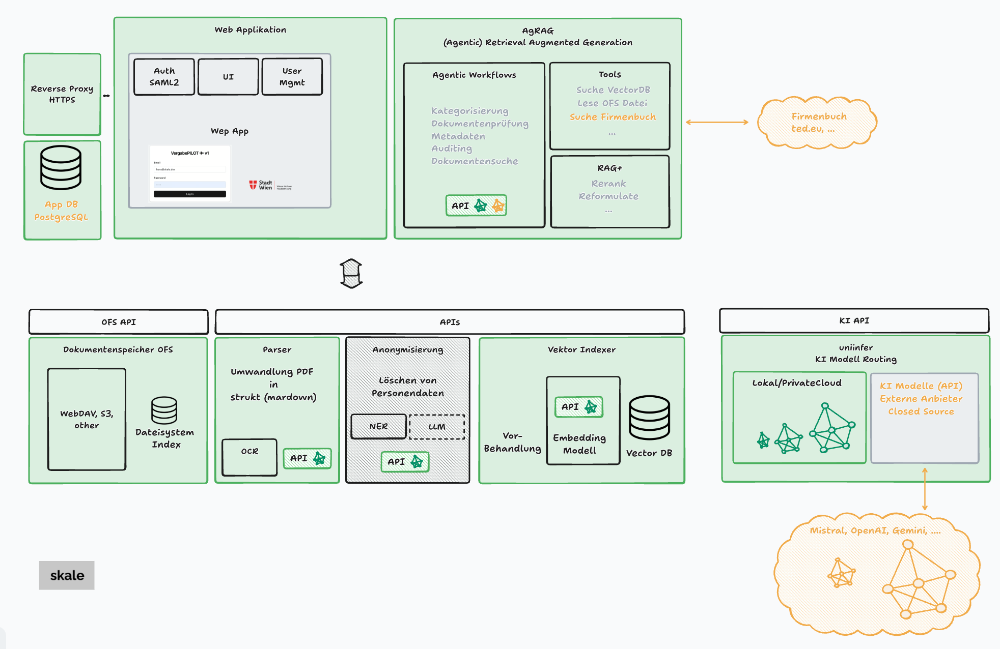

# Systemarchitektur – Übersicht (Datenschutz)

## Ziel & Hosting
- Alle Module und Datenbanken laufen lokal auf EU-VPS (Wien/Frankfurt).
- Kein Drittlandtransfer in Produktion.

## Komponenten
- Web-App (Login, gehashte Passwörter)
- Backend (Python)
- OFS-Dokumentensystem (Postgres, WebDAV)
- Parser, Vector-Index
- Lokale KI-Modelle (Deepseek, Mistral)
-   Entwicklung: Gemini (USA, nur öffentliche Daten)
- Datenbanken

## Datenarten
- Benutzerkonten, Zugriffslogs
- Dokumente (potenziell personenbezogen)
- Metadaten/Indices

## Schutzmaßnahmen
- TLS überall, WebDAV nur über HTTPS
- Verschlüsselung at-rest (DB/Storage)
- geplant: OAuth/OIDC mit MS Directory Services (MFA, RBAC)
- Secret-Management (Vault/KMS)
- Audit-Logs, Backups in EU

## Ausnahmen
- Entwicklung: Managed App-DB, Gemini (USA, nur öffentliche Daten)

## Aufbewahrung & Löschung
- Audit-Trails/Logs vorhanden
- Retention-Policy wird festgelegt und automatisiert

## Workflow (Kurz)
1. Login
2. Daten hochladen
3. Automatisches Parsing & Speicherung (OFS Index)
4. KI-Analyse & Speicherung von Metadaten/Audits
5. Nutzer steuert Freigaben

